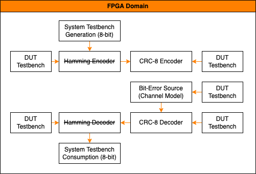

# ISU-ECE-5508-S23
Idaho State University repository for FPGA projects in ECE5508 (Advanced Digital Logic Design) spring 2023.

# Python Simulations
Use to model CRC encoder/decoder and Hamming encoder/decoder. Important to get models right before using SystemVerilog (eventually VHDL as well) to program FPGA.

# System Diagram

